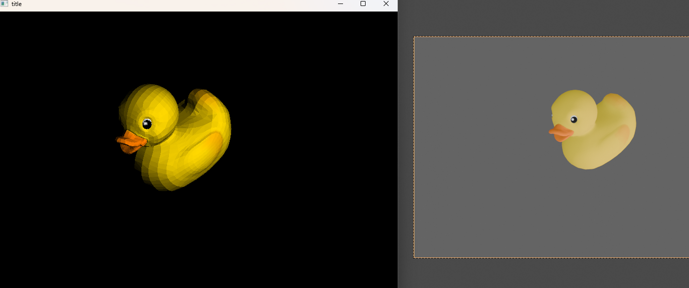

# ry‘s ray
ry is learning ray trace.

Simple project focused on verifying ray tracing algorithms using only CPU-based computation.

## Features

1、receive a simple glb/gltf input

2、use the first camera  and the first light found to render target

3、also only  the first found texture used  :)

## Hardware

 intel i7-8700

## Perf

- v1.0.0 3000+ triangles take about 3 seconds to render on intel i7-8700

## Version
- v1.0.0 use the first camera  and the first light found to render target
- v1.0.1 multi-primitive, light, texture support

## Test File
see https://github.com/KhronosGroup/glTF-Sample-Models

